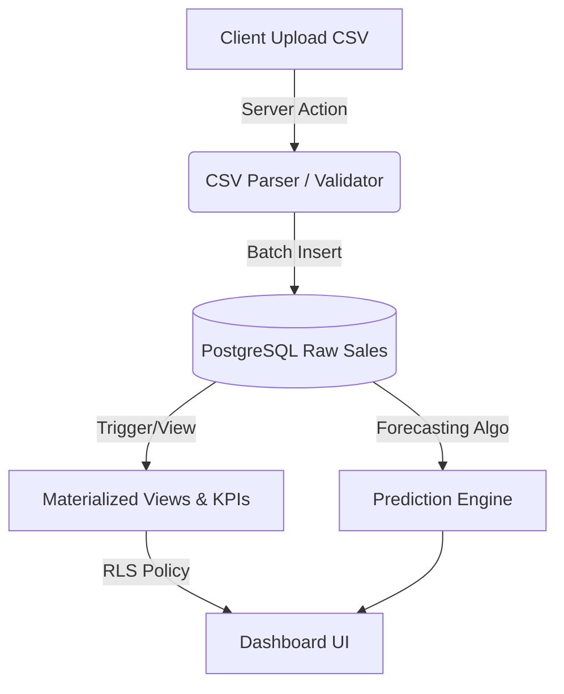

# 📊 RevenueLens - Sales Analytics & Forecasting Platform


**RevenueLens** is a full-stack SaaS application that transforms raw sales CSV exports into actionable financial
dashboards. It solves the problem of manual spreadsheet reporting by providing automated ETL pipelines, data
visualization, and revenue forecasting.

🔗 **Live Demo:** [Ver en Vercel](revenuelens.vercel.app)

## 🚀 Key Features

### 1. Data Engineering & ETL

* **High-Performance CSV Parsing:** Server-side parsing using `PapaParse` to handle large datasets efficiently.
* **Batch Processing:** Implements transactional batch inserts into PostgreSQL to ensure data integrity during uploads.
* **Smart Validation:** Automatic column detection and data sanitization (currency cleaning, date normalization).

### 2. Advanced Analytics

* **Financial Forecasting:** Built-in algorithm (Moving Average) to project future revenue based on historical trends.
* **Dynamic Aggregation:** Uses SQL Views (`daily_metrics`, `dataset_kpis`) for real-time aggregation without impacting
  read performance.
* **Interactive Charts:** Responsive visualizations using `Recharts` for revenue trends and product distribution.

### 3. Architecture & Security

* **Multi-Tenancy:** Strict data isolation using **Row Level Security (RLS)** policies in PostgreSQL. Users can only
  access data belonging to their business workspace.
* **Next.js 15 App Router:** Leveraging Server Components for data fetching and Client Components for interactivity.
* **Optimistic UI:** Staggered animations and skeleton loaders (`Framer Motion`) for a seamless user experience.

## 🛠 Tech Stack

* **Framework:** Next.js 15 (App Router)
* **Language:** TypeScript
* **Database:** PostgreSQL (via Supabase)
* **Auth:** Supabase Auth (Magic Link, OAuth, Email/Password)
* **Styling:** Tailwind CSS + Shadcn UI
* **Visualization:** Recharts
* **Infrastructure:** Vercel

## 🏗 System Architecture

The application follows a strict separation of concerns with a heavy reliance on database-level logic for performance:



## 🔌 Database Schema

The database is designed for scale with normalized tables and RLS enabled:

* **profiles** & **businesses**: Handle user hierarchy and workspace grouping.

* **datasets**: Metadata for uploaded files (status tracking: processing -> ready).

* **sales**: The core ledger containing individual transaction records linked to datasets.

## 💻 Getting Started

1. Clone the repo

```bash
git clone [https://github.com/your-username/revenuelens.git](https://github.com/your-username/revenuelens.git)
```

2. Install dependencies

```bash
npm install
```

3. Environment Setup Create a **.env.local** file with your Supabase credentials:

```bash
NEXT_PUBLIC_SUPABASE_URL=your_project_url
NEXT_PUBLIC_SUPABASE_ANON_KEY=your_anon_key
```

4. Run Development Server

```bash
npm run dev
```